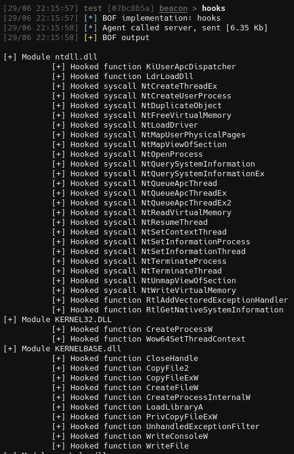

## FindUserHooks
**FindUserHooks** is a BOF designed to detect userland hooks placed by EDR solutions across all loaded modules.

While multiple other BOF projects exist for detecting hooks - such as [Detect-Hooks](https://github.com/anthemtotheego/Detect-Hooks) - they focus on identifying hooked syscalls in `ntdll`.

However, EDRs are known to place inline hooks in other DLLs as well, which can lead to detections. FindUserHooks expands coverage beyond just `ntdll` to help uncover additional hooks.

---
### How FindUserHooks Works
Detecting standard hooked syscalls is relatively straightforward because legitimate syscall stubs in `ntdll` typically with the byte sequence: `0x4c, 0x8b, 0xd1, 0xb8` and if this signature is missing, the syscall is likely hooked. 

We use this logic to flag potentially hooked syscalls in `ntdll`.

To catch inline hooks elsewhere, the script parses all loaded modules, checking the first instruction of each exported function. If the function begins with a `0xE9` (`JMP`), and the destination lies outside the module's own address space, it is likely an inline hook and is flagged.

FindUserHooks has been tested successfully against multiple EDRs.

---

### Safety Checks

To minimize the risk of crashing the beacon when parsing potentially invalid modules, the following safety checks are implemented:

- The DLL path is not null and exists.
- The module file has a `.dll` extension.
- PE headers (DOS, NT, and Optional) are validated before use.

If any of these checks fail, the module is silently skipped.

---

### How to Compile

To compile this BOF, simply run `make`.

---

### Caveats

- No x86 module (only x64 is supported).